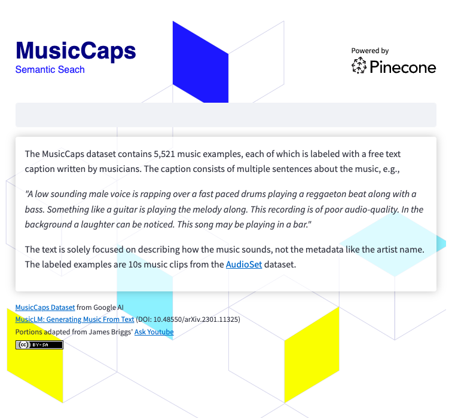

# MusicCaps Demo - Semantic Search on Audio Captions

A demonstration of [semantic search](https://en.wikipedia.org/wiki/Semantic_search) using the vector database [Pinecone](https://pinecone.io) and the [MusicCaps Dataset](https://huggingface.co/datasets/google/MusicCaps) from Google AI.

## Prerequisites

- A Starter (free) [Pinecone Account](https://app.pinecone.io/?sessionType=signup)
- A Pinecone API Key (Note the key value and the environment from the Pinecone console)

## Creating the Pinecone Index

Step through the Notebook [init-pinecone-index.ipynb](https://github.com/ben-ogden/musiccaps/blob/main/init-pinecone-index.ipynb) to

1. Load & Preview the Dataset
2. Initialize the Transformer
3. Create the Pinecone Index
4. Generate Embeddings and Populate the Index

Notes:
- You will need to replace `YOUR_API_KEY` and `YOUR_REGION` with the values shown from the API Keys tab in the Pinecone console. 
- If you take the default settings in Colab, it could take some time to generate embeddings and populate the index (About 20-25 minutes) - Great time for a coffee break. Or, set the runtime to use a GPU in ****Edit | Settings > Hardware Accelerator****. You can select T4 as GPU type in the free tier. This will generate the embeddings and populate the index in under a minute!

## Ready for Semantic Search!

There is a sample query at the end of the notebook. Replace the `query` value to experiment with semantic search across the MusicCaps Dataset.

```python
query = 'lively eastern european folk music with strings outdoors'
search_pinecone(query)
```


```python
{'matches': [{'id': '5327',
              'metadata': {'aspect_list': "['romanian folk music', 'live "
                                          "performance', 'instrumental', "
                                          "'accordion', 'upright bass', "
                                          "'acoustic guitar', 'percussion', "
                                          "'fiddle', 'lively', 'upbeat', "
                                          "'joyful']",
                           'audioset_positive_labels': '/m/0mkg',
                           'author_id': 9.0,
                           'caption': 'This is the live performance of a '
                                      'Romanian folk music piece. It is '
                                      'instrumental. There is an accordion '
                                      'playing the leading melody while the '
                                      'fiddle, acoustic guitar and the upright '
                                      'bass play in the background. There is a '
                                      'percussive element in the rhythmic '
                                      'background. The atmosphere is lively '
                                      'and joyful.',
                           'end_s': 30.0,
                           'is_audioset_eval': False,
                           'is_balanced_subset': False,
                           'start_s': 20.0,
                           'ytid': 'xR2p3UED4VU'},
              'score': 0.658422887,
              'values': []},
              
              ...
              
              ],
 'namespace': ''}
```

You'll get a sense for the results reading the `caption` field and noting the `score`. The `ytid` is the YouTube video id and `start_s` defines the starting point for the relevant video.


----------


# Running the Demo Application

## tl;dr
```console
streamlit run search-app.py
```



## Install the pinecone-client and streamlit

To run the search app, you'll need to
1. Create and populate the Pinecone index using the notebook above ^
2. Setup a Python environment. macOS users can use thhis -
    [Python Environment Setup for macOS](https://gist.github.com/ben-ogden/c139b8c73b81751ab3e0bbafc9282c8f)
3. [Install Streamlit](https://docs.streamlit.io/library/get-started/installation) and prerequisites. 

```console
git clone https://github.com/ben-ogden/musiccaps.git
cd musiccaps
pipenv shell
pipenv install pinecone-client streamlit
streamlit version
...
Streamlit, version 1.22.0
```

Create a secrets file in ~/.streamlit/secrets.toml and set your `PINECONE_KEY` and `PINECONE_ENV`

```console
PINECONE_KEY = "..."
PINECONE_ENV = ".."
```

## Happy Semantic Searching!

```console
streamlit run search-app.py
```


## Next Steps

This dataset could be a good candidate for experimenting with [Hybrid Search](https://docs.pinecone.io/docs/hybrid-search) or using [Metadata Filtering](https://docs.pinecone.io/docs/metadata-filtering) using the values in the `metadata` `aspect_list` as keywords.
